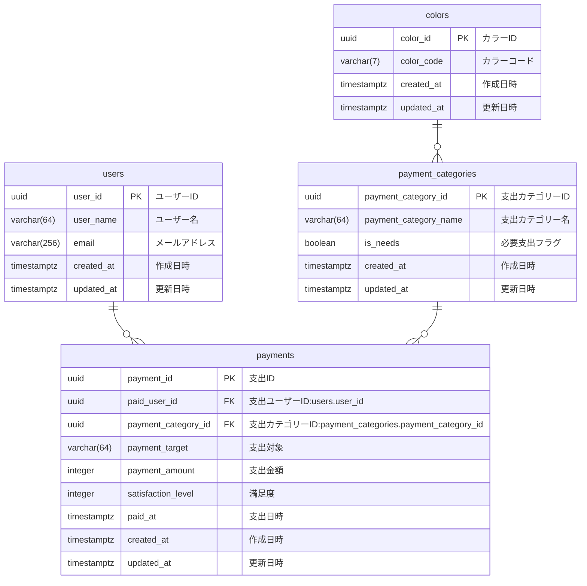

# ER 図

```mermaid
erDiagram
    colors ||--o{ payment_categories : ""
    users ||--o{ payments : ""
    payment_categories ||--o{ payments : ""

    users {
        uuid user_id PK "ユーザーID"
        varchar(64) user_name "ユーザー名"
        varchar(256) email "メールアドレス"
        timestamptz created_at "作成日時"
        timestamptz updated_at "更新日時"
    }

    colors {
        uuid color_id PK "カラーID"
        varchar(7) color_code "カラーコード"
        timestamptz created_at "作成日時"
        timestamptz updated_at "更新日時"
    }

    payment_categories {
        uuid payment_category_id PK "支出カテゴリーID"
        varchar(64)  payment_category_name "支出カテゴリー名"
        boolean is_needs "必要支出フラグ"
        timestamptz created_at "作成日時"
        timestamptz updated_at "更新日時"
    }

    payments {
        uuid payment_id PK "支出ID"
        uuid paid_user_id FK "支出ユーザーID:users.user_id"
        uuid payment_category_id FK "支出カテゴリーID:payment_categories.payment_category_id"
        varchar(64) payment_target "支出対象"
        integer payment_amount "支出金額"
        integer satisfaction_level "満足度"
        timestamptz paid_at "支出日時"
        timestamptz created_at "作成日時"
        timestamptz updated_at "更新日時"
    }
```
