# インフラ構成図

```mermaid
architecture-beta
    group prd_google_cloud(logos:google-cloud)[prd]
    group prd_internal[Internal] in prd_google_cloud

    service prd_cloud_sql(logos:postgresql)[Cloud SQL] in prd_internal
    service prd_cloud_run_be(logos:google-cloud-run)[Cloud Run Backend] in prd_internal
    service prd_cloud_run_fe(logos:google-cloud-run)[Cloud Run Frontend] in prd_google_cloud

    prd_cloud_run_be:R --> L:prd_cloud_sql
    prd_cloud_run_fe:R --> L:prd_cloud_run_be


    group dev_google_cloud(logos:google-cloud)[dev]
    group dev_internal[Internal] in dev_google_cloud

    service dev_cloud_sql(logos:postgresql)[Cloud SQL] in dev_internal
    service dev_cloud_run_be(logos:google-cloud-run)[Cloud Run Backend] in dev_internal
    service dev_cloud_run_fe(logos:google-cloud-run)[Cloud Run Frontend] in dev_google_cloud

    dev_cloud_run_be:R --> L:dev_cloud_sql
    dev_cloud_run_fe:R --> L:dev_cloud_run_be


    group common_google_cloud(logos:google-cloud)[common]

    service common_artifact_registry(logos:docker-icon)[Artifact Registry] in common_google_cloud
    service common_cloud_storage(disk)[Cloud Storage] in common_google_cloud

    service github(logos:github-icon)[GitHub]

    service developer(logos:visual-studio)[Developer]

    junction developer_to_common_artifact_registry

    developer:R --> L:github
    developer:T --> B:common_cloud_storage
    github:R -- L:developer_to_common_artifact_registry
    developer_to_common_artifact_registry:T --> B:common_artifact_registry

    junction artifact_registry_to_cloud_run_fe
    common_artifact_registry:R --> L:artifact_registry_to_cloud_run_fe
    artifact_registry_to_cloud_run_fe:T --> B:prd_cloud_run_fe
    artifact_registry_to_cloud_run_fe:B --> T:dev_cloud_run_fe

    junction artifact_registry_to_cloud_run_be
    common_artifact_registry:R --> L:artifact_registry_to_cloud_run_be
    artifact_registry_to_cloud_run_be:T --> B:prd_cloud_run_be
    artifact_registry_to_cloud_run_be:B --> T:dev_cloud_run_be
```

## prd, dev

Google Cloud の本番および開発用プロジェクト。

- Backend は Frontend のサービスアカウントでアクセス可能。常に Next.js のサーバーサイドからリクエストする。
- Cloud SQL は Backend のサービスアカウントでアクセス可能。
- Cloud SQL と Backend はアクセスを internal に制限する。

## common

Docker Image を管理する Artifact Registry および、Terraform Backend 用の Cloud Storage を用意する Google Cloud プロジェクト。

- GitHub Actions 用のサービスアカウントに Artifact Registry 書き込み権限を付与
- prd,dev の Cloud Run サービスエージェントに Artifact Registry 読み取り権限を付与

## GitHub

コードの管理および CI/CD の実行を行う。

- Publish release で prd デプロイ
- develop ブランチへの push で dev デプロイ
- PR 作成・更新で CI 実行
- feature -> develop -> main の流れでマージする。

## Developer

開発者。

- terraform apply で common の Cloud Storage の state を更新
- git push で GitHub にコードプッシュ
