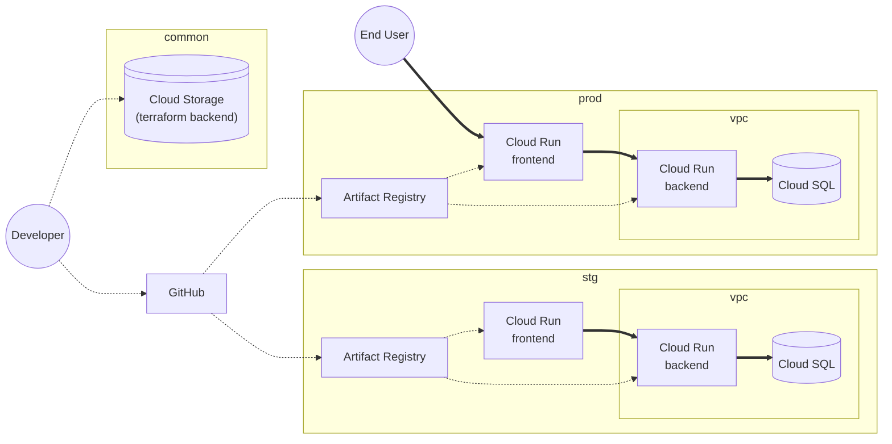

# インフラ構成

## prod, stg

本番およびステージング用の Google Cloud プロジェクト。

- Backend は Frontend のサービスアカウントでアクセス可能。常に Next.js のサーバーサイドからリクエストする。
- Cloud SQL は Backend のサービスアカウントでアクセス可能。
- Cloud SQL と Backend はアクセスを internal に制限する。

## common

本番、開発共通で利用する Google Cloud プロジェクト。

- Terraform Backend 用の Cloud Storage

## GitHub

コードの管理および CI/CD の実行を行う。

- Publish release で prod デプロイ
- stg は Deploy Dispatcher でデプロイ
- PR 作成・更新で CI 実行
- develop -> main の流れでマージする。

## Developer

開発者。

- terraform apply で common の Cloud Storage の state を更新
- git push で GitHub にコードプッシュ
