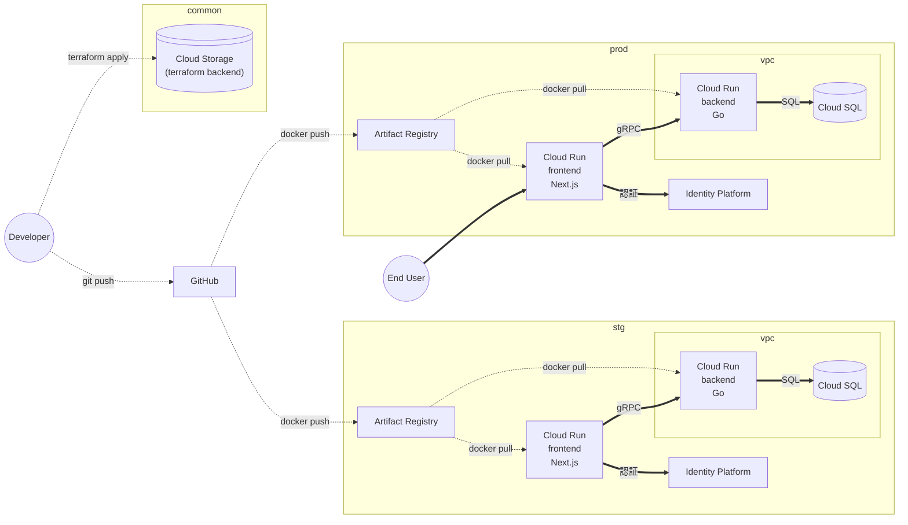

# インフラ構成

## prod, stg

本番およびステージング用の Google Cloud プロジェクト。

### frontend

- UI を担当する。
- 外部リクエストは全て Next.js のサーバーサイドで行う。

### backend

- db リクエストを担当する。
- Frontend のサービスアカウントからのみリクエストを受け付ける。
- VPC 内からのみリクエストを受け付ける。

### db

- VPC 内からのみリクエストを受け付ける。
- Backend のサービスアカウントからのみリクエストを受け付ける。

## common

本番、開発共通で利用する Google Cloud プロジェクト。

- Terraform Backend 用の Cloud Storage

## GitHub

コードの管理および CI/CD の実行を行う。

- Deploy Dispatcher でデプロイ
- PR 作成・更新で CI 実行
- develop -> main の流れでマージする。

## Developer

開発者。

- terraform apply で common の Cloud Storage の state を更新
- git push で GitHub にコードプッシュ
