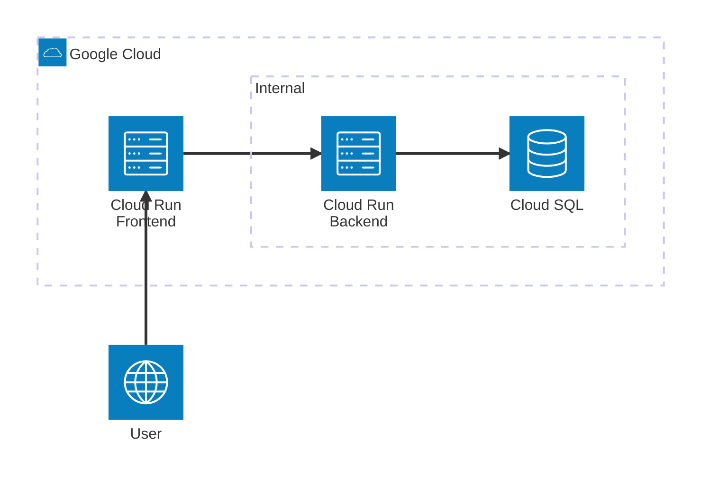

# インフラ構成図

```mermaid
architecture-beta
    group google_cloud(cloud)[Google Cloud]
    group internal[Internal] in google_cloud

    service cloud_sql(database)[Cloud SQL] in internal
    service cloud_run_be(server)[Cloud Run Backend] in internal
    service cloud_run_fe(server)[Cloud Run Frontend] in google_cloud
    service user(internet)[User]

    cloud_run_be:R --> L:cloud_sql
    cloud_run_fe:R --> L:cloud_run_be
    user:T --> B:cloud_run_fe
```
