# インフラ構成

```mermaid
architecture-beta
  group prod_google_cloud(logos:google-cloud)[prod]
  group prod_internal[Internal] in prod_google_cloud

  service prod_artifact_registry(logos:docker-icon)[Artifact Registry] in prod_google_cloud
  service prod_cloud_run_fe(logos:google-cloud-run)[Cloud Run Frontend] in prod_google_cloud

  service prod_cloud_run_be(logos:google-cloud-run)[Cloud Run Backend] in prod_internal
  service prod_cloud_sql(logos:postgresql)[Cloud SQL] in prod_internal

  prod_artifact_registry:T --> B:prod_cloud_run_fe
  junction prod_ar_to_crb
  prod_artifact_registry:R -- L:prod_ar_to_crb
  prod_ar_to_crb:T --> B:prod_cloud_run_be
  prod_cloud_run_fe:R --> L:prod_cloud_run_be
  prod_cloud_run_be:R --> L:prod_cloud_sql



  group dev_google_cloud(logos:google-cloud)[dev]
  group dev_internal[Internal] in dev_google_cloud

  service dev_artifact_registry(logos:docker-icon)[Artifact Registry] in dev_google_cloud
  service dev_cloud_run_fe(logos:google-cloud-run)[Cloud Run Frontend] in dev_google_cloud

  service dev_cloud_run_be(logos:google-cloud-run)[Cloud Run Backend] in dev_internal
  service dev_cloud_sql(logos:postgresql)[Cloud SQL] in dev_internal

  dev_artifact_registry:B --> T:dev_cloud_run_fe
  junction dev_ar_to_crb
  dev_artifact_registry:R -- L:dev_ar_to_crb
  dev_ar_to_crb:B --> T:dev_cloud_run_be
  dev_cloud_run_be:R --> L:dev_cloud_sql
  dev_cloud_run_fe:R --> L:dev_cloud_run_be



  group common_google_cloud(logos:google-cloud)[common]

  service common_cloud_storage(disk)[Cloud Storage] in common_google_cloud



  service developer(logos:visual-studio)[Developer]
  service github(logos:github-icon)[GitHub]

  developer:T --> B:common_cloud_storage
  developer:R --> L:github
  junction g_to_ar
  github:R -- L:g_to_ar
  g_to_ar:T --> B:prod_artifact_registry
  g_to_ar:B --> T:dev_artifact_registry



  service end_user(logos:chrome)[End User]

  end_user:B --> T:prod_cloud_run_fe
```

## prod, dev

本番および開発用の Google Cloud プロジェクト。

- Backend は Frontend のサービスアカウントでアクセス可能。常に Next.js のサーバーサイドからリクエストする。
- Cloud SQL は Backend のサービスアカウントでアクセス可能。
- Cloud SQL と Backend はアクセスを internal に制限する。

## common

本番、開発共通で利用する Google Cloud プロジェクト。

- Terraform Backend 用の Cloud Storage
- Docker Image を管理する Artifact Registry
  - GitHub Actions 用のサービスアカウントに Artifact Registry 書き込み権限を付与
  - prod,dev の Cloud Run サービスエージェントに Artifact Registry 読み取り権限を付与

## GitHub

コードの管理および CI/CD の実行を行う。

- Publish release で prod デプロイ
- develop ブランチへの push で dev デプロイ
- PR 作成・更新で CI 実行
- feature -> develop -> main の流れでマージする。

## Developer

開発者。

- terraform apply で common の Cloud Storage の state を更新
- git push で GitHub にコードプッシュ
