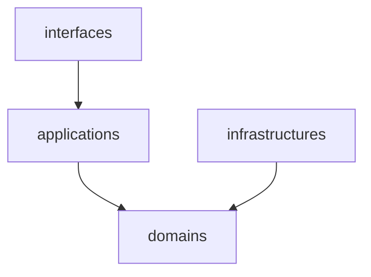
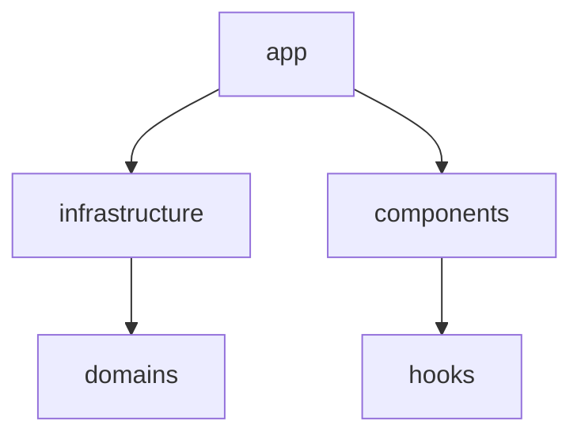

# ソフトウェアアーキテクチャ

モノレポ構成で、バックエンド、データベース、フロントエンド、インフラを全て管理します。

```
payment-manager/
├── .github/     # CI/CD
├── backend/     # GoのgRPCサーバー
├── db/          # DBスキーマ、マイグレーションファイル
├── docs/        # ドキュメント
├── frontend/    # Next.js
├── infra/       # インフラをterraformで管理
├── proto/       # gRPCのAPIスキーマ定義
├── scripts/     # 開発用のスクリプト
└── compose.yaml
```

- [`.github`](#github)
- [`backend`](#backend)
- [`db`](#db)
- [`docs`](#docs)
- [`frontend`](#frontend)
- [`infra`](#infra)
- [`proto`](#proto)
- [`scripts`](#scripts)

## .github

Pull Request 作成時の CI や、デプロイを実行する Workflow を実装します。

Reusable Workflow は`reusable-*.yaml`という命名で統一します。

## backend

backend は DDD を採用し、ドメインレイヤーは他レイヤーに依存しないようにします。



```
payment-manager/
└── backend/
    ├── .infra/                    # Cloud Run設定
    │   ├── prod.yaml
    │   └── stg.yaml
    ├── cmd/                       # エントリーポイント(DI)
    │   └── grpc_server/
    │       └── main.go
    ├── config/
    │   └── config.go              # 環境変数の読み取り
    ├── domain/                    # ドメインレイヤー
    │   └── user/
    │       ├── entity.go
    │       ├── error.go
    │       ├── repository.go
    │       └── value_object.go
    ├── infrastructure/            # インフラストラクチャーレイヤー
    │   ├── cloudsql/
    │   │   └── client.go
    │   └── persistence/           # domainで定義されたrepositoryなどの実装
    │       ├── user_repository_create_user.sql
    │       └── user_repository.go
    ├── interface/
    │   ├── grpcservice            # gPRCサービス
    │   │   └── user.go
    │   └── proto/                 # protocで自動生成
    ├── lib/
    ├── test/                      # テスト
    ├── usecase/                   # ユースケースレイヤー
    │   └── user.go
    ├── Dockerfile
    └── go.mod
```

ファイル名は snake_case で統一します。パッケージ名は区切りなしの小文字で統一します。

## db

データベーススキーマとマイグレーション SQL を管理します。

```
payment-manager/
└── db/
    ├── migrations/
    │   ├── 20241222221600_create_users_table.sql
    │   └── 20241222224807_create_colors_table.sql
    ├── schema.sql  # dbmateで自動生成
    └── seeds.sql
```

## docs

開発用のドキュメントを管理します。

## frontend

frontend は backend と同様の domain を定義し、他レイヤーに依存しないようにします。



```
payment-manager/
└── frontend/
    ├── .infra/                   # Cloud Run設定
    ├── public/
    ├── src/
    │   ├── app/                  # ルーティング
    │   ├── components/           # 共通コンポーネント
    │   │   └── ui/               # shadcnで自動生成
    │   ├── domain/               # ドメインレイヤー
    │   │   └── user/
    │   │       ├── entity.ts
    │   │       ├── error.ts
    │   │       ├── index.ts      # バレルファイル
    │   │       ├── repository.ts
    │   │       └── value
    │   ├── hooks/                # カスタムフック
    │   ├── infrastructure/       # インフラストラクチャーレイヤー
    │   │   ├── google/           # protocで自動生成
    │   │   ├── persistence/      # domainで定義されたrepositoryなどの実装
    │   │   └── proto/            # protocで自動生成
    │   ├── lib/
    │   └── env.ts                # 環境変数の読み取り
    ├── Dockerfile                # 本番用
    ├── Dockerfile.dev            # ローカル開発用
    └── package.json
```

## infra

インフラを Terraform で管理します。

```
payment-manager/
└── infra/
    ├── environments/
    │   ├── common/
    │   ├── prod/
    │   └── stg/
    ├── globals/
    │   └── common.tfvars
    └── modules/
        ├── artifact_registry/
        └── cloud_run_service/
```

module を作成する必要のないものは resource でそのまま定義します。

複数 resource が必要なものなどは modules に共通化します。

### environments

環境ごとの Google Cloud プロジェクトを作成します。
terraform init, plan, apply コマンドは`infra/environments/{env}`配下で実行します。

module を作成する必要のないものは resource でそのまま定義します。

### globals

各プロジェクトで共通の設定をここに置きます。

- `common.tfvars` : 共通で使用する変数。`.gitignore`に指定します。

### modules

各環境で共通で利用する、複数 resource が必要なものを module として定義します。

modules が environments に依存しないように作成します。

## proto

Payment Manager のバックエンドとフロントエンド間の通信で使用する gPRC スキーマを定義します。

```
payment-manager/
└── proto/
    ├── user/
    │   └── v1/
    │       └── user.proto
    └── color/
        └── v1/
            └── color.proto
```

## scripts

開発用のスクリプトを管理します。

できるだけローカルにインストールするものは docker のみで済むようにします。
