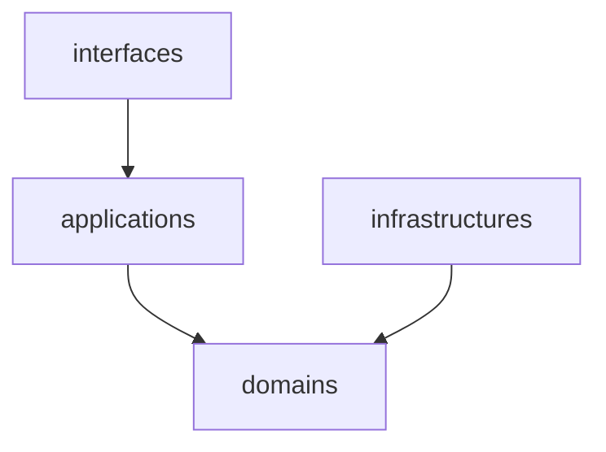
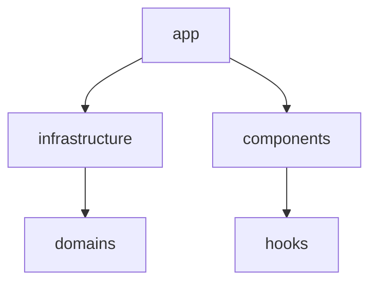

# ソフトウェアアーキテクチャ

モノレポ構成で、バックエンド、データベース、フロントエンド、インフラを全て管理します。

```
payment-manager/
├── .github/
├── backend/
├── db/
├── docs/
├── frontend/
├── infra/
├── scripts/
└── compose.yaml
```

- [`.github`](#github)
- [`backend`](#backend)
- [`db`](#db)
- [`docs`](#docs)
- [`frontend`](#frontend)
- [`infra`](#infra)
- [`scripts`](#scripts)

## .github

Pull Request 作成時の CI や、デプロイを実行する Workflow を実装します。

## backend

backend は DDD を採用し、ドメインレイヤーは他レイヤーに依存しないようにします。



```
payment-manager/
└── backend/
    ├── cmd/
    │   └── grpc-server/
    │       └── main.go
    ├── config/
    │   └── config.go
    ├── domain/
    │   └── user/
    │       ├── entity.go
    │       ├── error.go
    │       ├── repository.go
    │       └── value_object.go
    ├── infrastructure/
    ├── interface/
    ├── lib/
    ├── usecase/
    │   └── user/
    │       └── find_by_user_id.go
    ├── test/
    ├── Dockerfile
    └── go.mod
```

## db

データベーススキーマとマイグレーション SQL を管理します。

```
payment-manager/
└── db/
    ├── migrations/
    │   ├── 20241222221600_create_users_table.sql
    │   └── 20241222224807_create_colors_table.sql
    └── schema.sql
```

## docs

開発用のドキュメントを管理します。

## frontend

frontend は backend と同様の domain を定義し、他レイヤーに依存しないようにします。



```
payment-manager/
└── frontend/
    ├── public/
    ├── src/
    │   ├── app/
    │   ├── components/
    │   │   └── ui/
    │   ├── domain/
    │   │   └── user/
    │   │       ├── entity.ts
    │   │       ├── error.ts
    │   │       └── repository.ts
    │   ├── hooks/
    │   ├── infrastructure/
    │   └── lib/
    ├── Dockerfile
    └── package.json
```

## infra

インフラを Terraform で管理します。

```
payment-manager/
└── infra/
    ├── environments/
    │   ├── common/
    │   ├── dev/
    │   └── prd/
    ├── globals/
    │   ├── backend.tf
    │   └── versions.tf
    └── modules/
        ├── artifact_registry/
        └── cloud_run_service/
```

## scripts

開発用のスクリプトを管理します。
