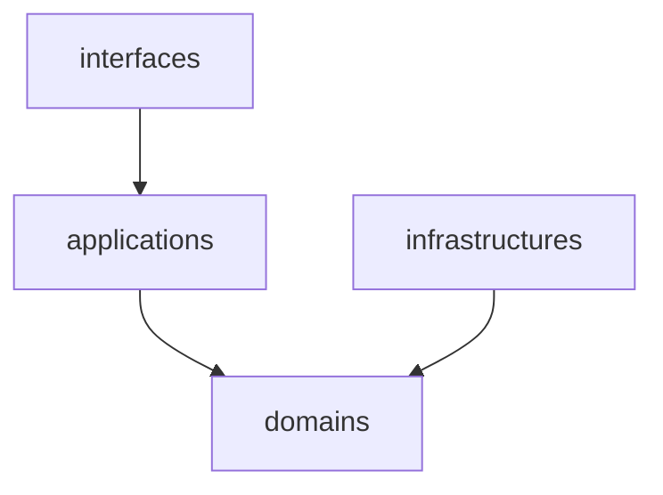

# ソフトウェアアーキテクチャ

モノレポ構成で、バックエンド、データベース、フロントエンド、インフラを全て管理します。

```
payment-manager/
├── .github/
├── backend/
├── db/
├── docs/
├── frontend/
├── infra/
├── compose.yaml
├── Makefile
└── README.md
```

- [`.github`](#github)
- [`backend`](#backend)
- [`db`](#db)
- [`docs`](#docs)
- [`frontend`](#frontend)
- [`infra`](#infra)

## .github

Pull Request 作成時の CI や、デプロイを実行する Workflow を実装します。

## backend

backend は DDD を採用し、ドメインレイヤーは他レイヤーに依存しないようにします。



```
payment-manager/
└── backend/
    ├── cmd/
    │   └── graphql-server/
    │       └── main.go
    ├── applications/
    │   └── user.go
    ├── configs/
    │   └── config.go
    ├── domains/
    │   └── user/
    │       ├── entity.go
    │       ├── errors.go
    │       ├── factory.go
    │       ├── query.go
    │       ├── repository.go
    │       ├── service.go
    │       ├── user.go
    │       └── value_object.go
    ├── infrastructures/
    ├── interfaces/
    ├── shared/
    └── tests/
```

- [`applications`](#applications)
- [`domains`](#domains)
- [`infrastructures`](#infrastructures)
- [`interfaces`](#interfaces)

### applications

### domains

### infrastructures

### interfaces

## db

## docs

## frontend

## infra
